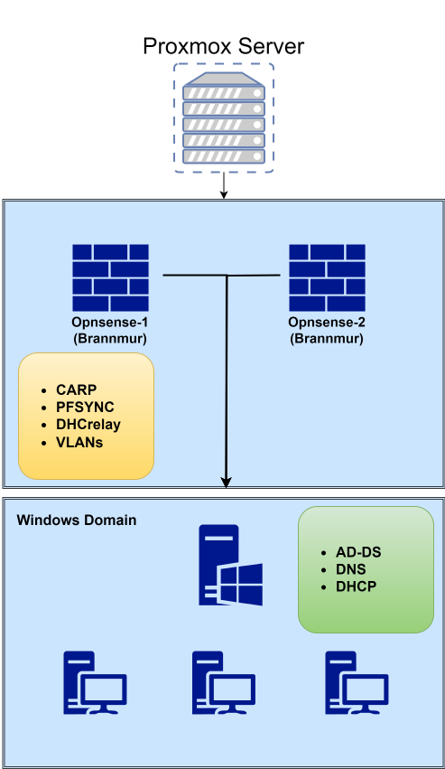

[← Tilbake til forside](../)

## Teknologier
* **Opnsense:** Her setter jeg opp Virtual IP (CARP), VLANs, brannmur regler, Radius, etc.  
* **Win-server:** Her setter jeg opp AD-DS, DNS/DHCP, GPOs, OUs med brukere/grupper/klienter, etc.
* **Win-klient:** Testing av domene kobling, GPOs, brukere, DHCP relay, etc.

## Om Prosjektet
Jeg ville tilegne meg mer kunnskap om Windows server og deres bruksområder, jeg ville også holde det separert fra Omada så jeg valgte å sette opp et par
Opnsense brannmurer i Proxmox, disse er koblet til Omada, men bruker kun Proxmox interne virtuelle bruer ut mot servere og klienter. Dette vil si at windows server og klient er 
koblet til et eget interface i Proxmox med egne VLAN tags. 

## Diagram av prosjektet

