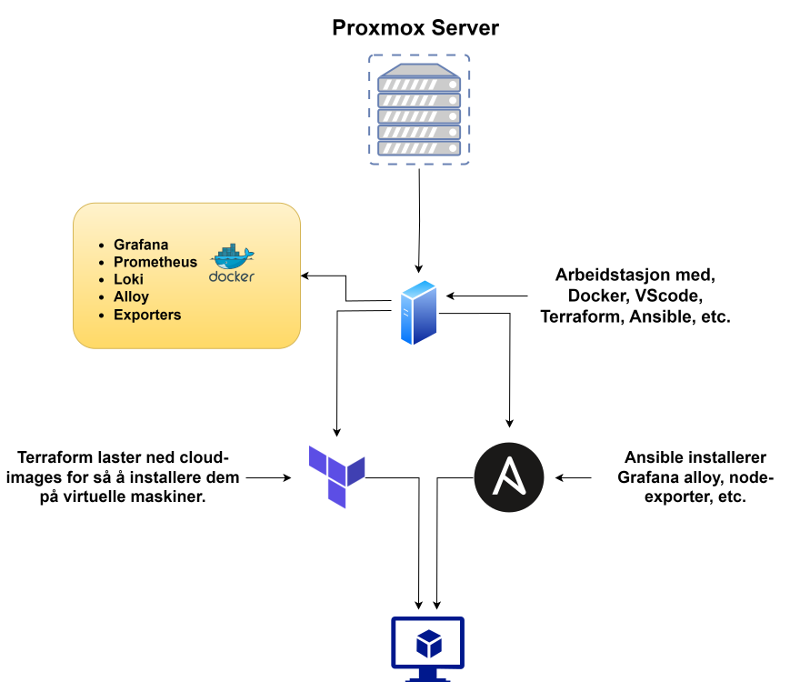

[← Tilbake til forside](../)

## Teknologier
* **Terraform:** For å bygge infrastruktur på Proxmox ved hjelp av kode i stedet for å manuelt installere alt.
* **Ansible:** For å konfigurere maskiner som ble laget via Terraform, installasjon av Grafana Alloy, Node-exporter, etc.
* **Docker:** For å kjøre Grafana-stacken min som består av Prometheus, Loki, Grafana, Alloy, samt noen andre exportere.

## Om prosjektet
Jeg var ute etter å bygge erfaring med IaC-verktøy. Så det første jeg gjorde,
var å sette opp en virtuell arbeidsstasjon i Proxmox hvor jeg kjører VS Code for enklere å ha kontroll over koden min,
Docker slik at jeg kan spinne opp containere direkte på samme maskin,
Terraform så jeg kan lære å automatisere prosessen med å sette opp nye maskiner ved bruk av kode,
samt Ansible for å pushe konfigurasjoner direkte fra samme maskin.

## Diagram av prosjektet

